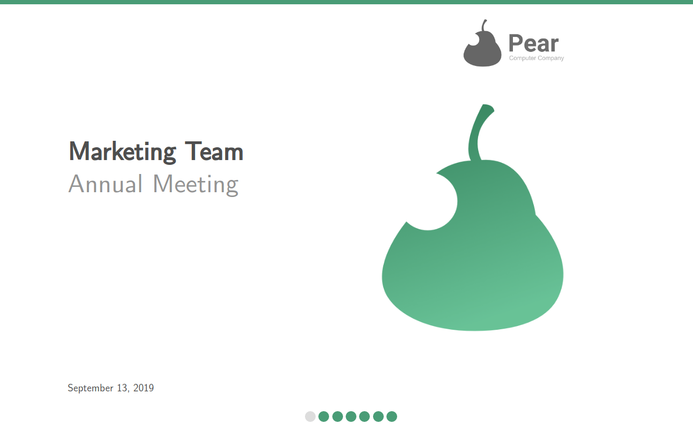
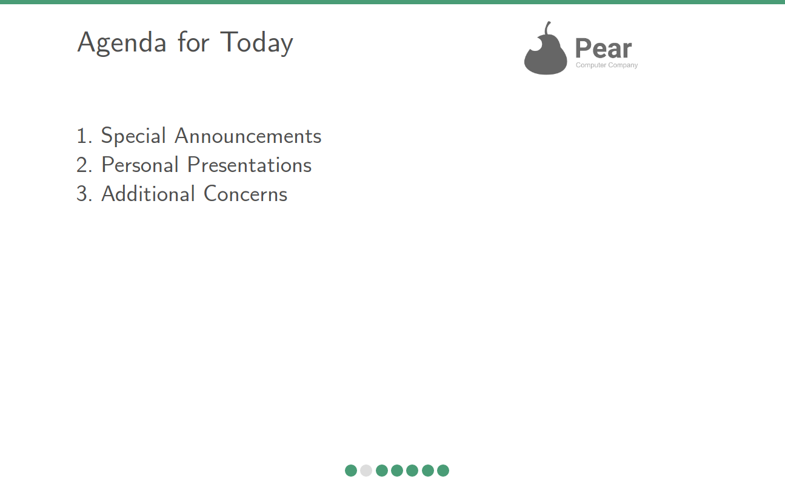
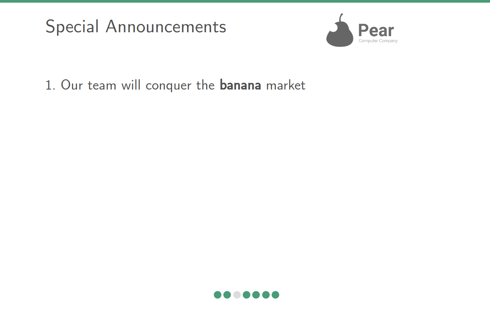
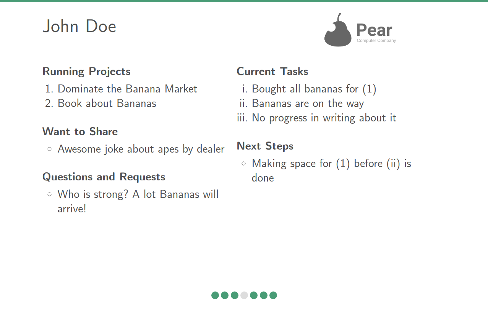
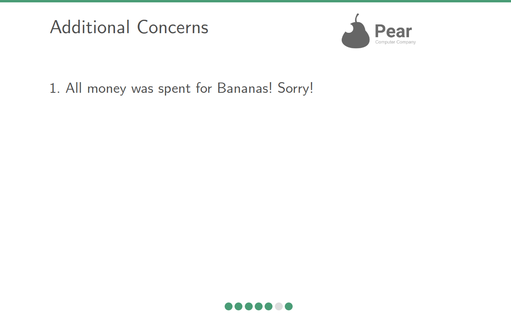
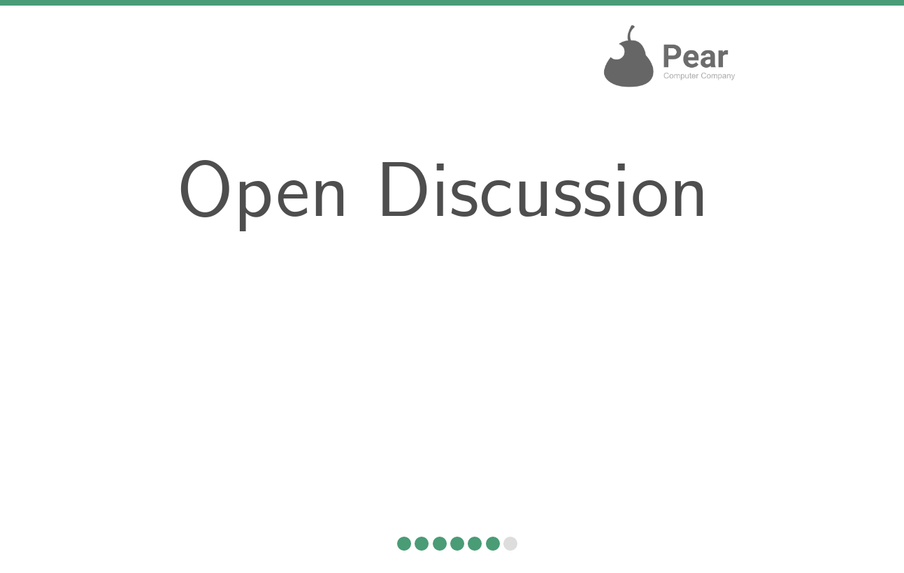

# The Slideshow Bob Presentation Generator 

Slideshow Bob is a lightweight, and modern team status report presentation generator suitable for medium to large teams, which need to run status updates on a regular basis and which look for a solution that has an easy workflow, that is scriptable and that need a minimum on technical infrastructure to run. 

Not yet convinced? Have a look at the following features, the workflow description and scripting commands. 

By the way, Slideshow Bob is customizable, too.

## Features

In a nutshell, these are the feature of Slideshow Bob:

- **Focussed Slides**: presenters are activated to express their current state crystal clear by 
  explicitly requiring them to speak about running projects, current tasks, 
  questions and requests, next steps, and what they want to share

- **Small Management Overhead**: slides of single presenters are only included if new information is present,
  same for a special announcements slide and an additional concerns slide. Presenters fill their particular markdown file, which is always stored at the same location, always automatically reset after the last presentation, and which has minimal structure overhead

- **Clear and Modern**: simple design language to focus on content with HTML5/CSS slides supporting directly jumps to specific slides, and navigation though the presentation by both arrow keys and the navigation bar. The responsive design supports tiny beamer resolutions, too.

- **History Management**: commit based history management that adds individual presenters content to the 
  presents report file, and archives additional concerns and announcements. Report files are markdown formatted and are ordered by commit date.
- Scriptable: a few python scripts to commit the latest presentation to history, build the presentation or add new presenters. 

## Workflow by Example

Imaging a medium-sized team that works in a company, that has a strong branding for a particular fruit. On a regular basis, all team mates assemble and give an overview on their current state. A dedicated team member, Jane Doe, is responsible to manage the status reports process. By luck, she stumbled upon Slideshow Bob.

Another team member, John Doe, gives his regular report and must make a team-wide special announcement, and who wants to express some additional concerns. 

Let's follow both during their adventure with Slideshow Bob. Imagine Slideshow Bob is stored on some network drive (or stored in a repository, or ...)

### Personal Slides

A John Doe gives status information in his own personal slide description file, which is a markdown file with his name (e.g., `John Doe.md`) and which is always located in `content/latest/personal`. 

This file has the following structure:


```markdown

## Running Projects

- ...


## Current Tasks

- ...


## Questions and Requests

- ...


## Want to Share

- ...


## Next Steps

- ...


```

Let's say John works on two projects, buying more bananas and writing a book about it. To the point of the next meeting, we just had a phone call with the bananas dealer and always ordered some bananas. Since he was very busy with that, we couldn't manage to write much about it in his book. During the team meeting, John has questions on the color of bananas and tries to find a college who will help him carrying all soon arriving bananas. Since the dealer told John an awesome joke about apes, John wants to share this with his colleges. Finally, John's next steps are making some space in his office for the bunch of bananas that will arrive very soon. 

During the days, he fills his personal slide description file with the following contents.


```markdown

## Running Projects

- Dominate the Banana Market
- Book about Bananas


## Current Tasks

- Bought all bananas for (1)
- Bananas are on the way
- No progress in writing about it


## Questions and Requests

- Who is strong? A lot Bananas will arrive!


## Want to Share

- Awesome joke about apes by dealer


## Next Steps

- Making space for (1) before (ii) is done

```

### Special Announcements and Additional Concerns

Before the presentation day, John remembers that he not yet talked about his new strategy. Therefore, we will add some information to the special announcement slide. 
For this, he edits the announcements description file which is a markdown file by the name `Special Announcements.md`, which is always located in `content/latest/special`. 

This file has the following structure:


```markdown

- ...

```

John knows that his special announcement will be added to the presentation, once he give some information in this file. And so he will do: John give his announcement for the team by editing the file `Special Announcements.md` to

```markdown

- Our team will conquer the <b>banana</b> market 

```

Image that a bit of time passes and that the team presentation takes place very soon. Out of nowhere, John realizes that he has had absolute no budget, and just took all the team's money to pay for his bananas. He decided to  express an additional concern. Similar to his special announcement, he edits the file `Additional Concerns.md` located in `content/latest/special`. 

Briefly before the team meeting, all other team members prepare their personal slides, too.


### As Presentation Owner

The day of the meeting has arrived. Jane, who is responsible for the meeting and acts as a moderator, prepares the slides a few moments before the meeting. For this, she just runs the following Python script in the root directory of `Slideshow Bob`:

```

$ python start.py

```

The following presentation shows up in Janes browser:

<p float="left">
  
  
</p>

<p float="left">
  
  
</p>

<p float="left">
  
  
</p>

As it turns out, the company is about computer systems, and John works in the marketing team. Not surprisingly, there is a hot discussion after the presentation. Afterwards, Jane declares the end of this meeting. 

After all team mates have left the room, she types :

```

$ python commit.py

```

Slideshow Bob saves the current presentation to its history and resets all personal description files, special announcements and additional concerns. 

A few weeks after, Jane is asked to tell what has happen in the last meetings because the entire company run out of money. She open the history of Johns personal slides, which is the markdown file `John Doe.md`, which is stored in `content/history/personal`:


```markdown

# September 13, 2019

## Running Projects

- Dominate the Banana Market
- Book about Bananas


## Current Tasks

- Bought all bananas for (1)
- Bananas are on the way
- No progress in writing about it


## Questions and Requests

- Who is strong? A lot Bananas will arrive!


## Want to Share

- Awesome joke about apes by dealer


## Next Steps

- Making space for (1) before (ii) is done


# October 13, 2018

## Running Projects
 
- None, so far


## Current Tasks

- Just started


## Questions and Requests

- What is our company about, folks?


## Want to Share

- I really like Bananas


## Next Steps

- Maybe do some awesome stuff with Bananas


```

For clarification, Jane also opens the history for special announcements and additional concerns, stored in `content/history/special`.

After a brief meeting with HR, John is moved to another team. A few month later, Alice joins the team as a replacement for John. She really don't like Bananas.

To give Alice the possibility to make her personal slides with Slideshow Bob, Jane types:


```

$ python add-user.py Alice Wonderland

```

And everything is set up for Alice. Jane must not remove `John Doe.md` from `content/latest/personal` because he will not add new information in his new slides, and Slideshow Bob will not create a slide for him any longer. 

However, after a few year, Jane wants to wipe out John from the history of her company once and for all. 

Therefore, she deletes `content/latest/personal/John Doe.md` and `content/history/personal/John Doe.md`.

Easy as that.

## Commands

Slideshow Bob is commanded by a handful of python scripts. The basic commands that are used on a regular basis are:

1. `start.py` runs the html code generator, and opens the resulting presentation in the default web browser. Internally, this script just calls `build.py` and `open.py` (see below)

2. `commit.py` saves the latest changes of presenting users and special slides (announcements, concerns) in the history. After saving the latest changes, each personal slide and all special slides are reset to their initial state. Typically, `commit.py` is run after the latest presentation is done to prepare for the next presentation. 

In addition to these both scripts, the follow commands are available:

- `add-user.py ` adds a new presenter `user name` to `content/latest/personal` by creating a `user name.md` file. As long as `user name.md` exists in `content/latest/personal` and its content was somehow modified, it is added to `user name` history in `content/history/personal`. 

- `remove-user.py ` removes a presenter by deleting `content/latest/personal/user name.md`. The history of `user name` is not touched. If the `user name` history shall be removed too, delete `content/history/personal/user name.md` by hand.

- `build.py` runs the slide generator for the contents stored in `content/latest/personal` and `content/latest/special`. The resulting presentation is stored in `html/index.html`.

- `open.py` opens the current build presentation in `html/` by opening the default web browser. 

## Customization

Slideshow Bob can be customized in terms of branding. For this, change the following files in `customize/`:

- `frontpage-title` and `frontpage-sub-title` are both plain-text files that hold the string used for the title resp. sub-title.
- `color-highlight` is a plain-text file that contains the hex-value of the highlight color used in the slides (e.g., `#499C76`).
- `img/bob-brand.jpg` the logo that is shown in the right top corner of every slide
- `img/bob-eyecatch.png` the image that is shown on the right of the front page


## License

Slideshow Bob is licensed under MIT License, which means you must keep the copyright notice of Slideshow Bob intact when you use, copy, change, merge, publish, 
distribute, sublicense, and/or sell copies of the Slideshow Bob source code. This restriction does not affect presentations created with Slideshow Bob.